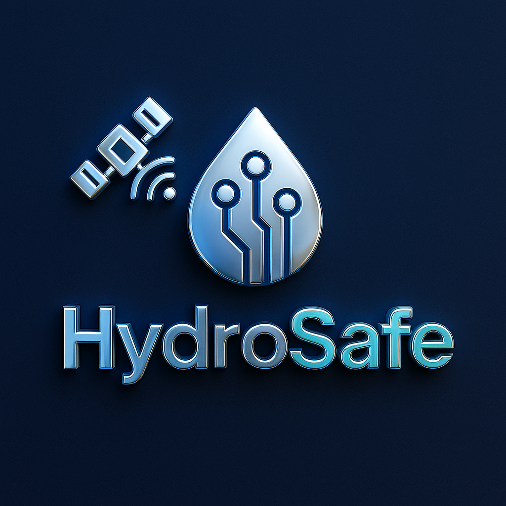

  

<h1 align="center">HydroSafe</h1>

<b>Inteligência para Segurança Hídrica e Climática</b>

**Inteligência para Segurança Hídrica**  

O HydroSafe é uma plataforma inteligente desenvolvida para apoiar a gestão da segurança hídrica, com foco no monitoramento, previsão de riscos de escassez e suporte à tomada de decisão. A solução oferece ferramentas para monitoramento dos níveis das barragens, balanço hídrico, previsão de chuvas e comunicação dos períodos de racionamento à população.

## Funcionalidades Principais
- Monitoramento do nível dos reservatórios
- Análise de séries temporais climáticas e hidrométricas
- Modelagem de tendência, sazonalidade, ENSO e mudanças climáticas
- Detecção automática do espelho d’água das barragens via deep learning
- Predição de risco hídrico com dados de previsão climática (CPTEC, NASA, ESA)
- Geração de alertas para gestores e população, incluindo horários de racionamento
- Visualização via dashboard e aplicativo mobile (em desenvolvimento)

## 🗂 Estrutura dos Arquivos
- `/r-scripts`: Scripts desenvolvidos em R para análise de séries temporais, tendências climáticas e modelagem estatística.
- `/python-scripts`: Scripts em Python para processamento de imagens de satélite, detecção de espelho d'água e desenvolvimento de modelos de deep learning.
- `/docs`: Documentação técnica, relatórios e materiais de apoio.
- `/data`: Dados de exemplo (se aplicável).
- `/images`: Figuras, QR Codes e outros recursos gráficos.

## Estado Atual do Projeto
O projeto encontra-se em fase de desenvolvimento e testes, com aplicação piloto no município de **Bagé – RS, Brasil**, que historicamente enfrenta desafios recorrentes de escassez hídrica e racionamento. 

## Parcerias
- Universidade Federal do Pampa (Unipampa)  
- Departamento de Água e Esgoto de Bagé (DAEB)

## Licença
> **Este projeto é a base para o desenvolvimento da futura empresa HydroSafe, focada em soluções de inteligência aplicada à segurança hídrica.**  
> O código é distribuído sob a licença [MIT](LICENSE), permitindo uso, cópia, modificação e distribuição. Entretanto, o modelo comercial da HydroSafe está centrado na oferta de serviços, suporte, hospedagem em nuvem e customizações da plataforma. 

## Contato
Desenvolvido por [Alexandro Schafer](https://github.com/alexandrogschafer)  
E-mail: alexandroschafer@unipampa.edu.br
